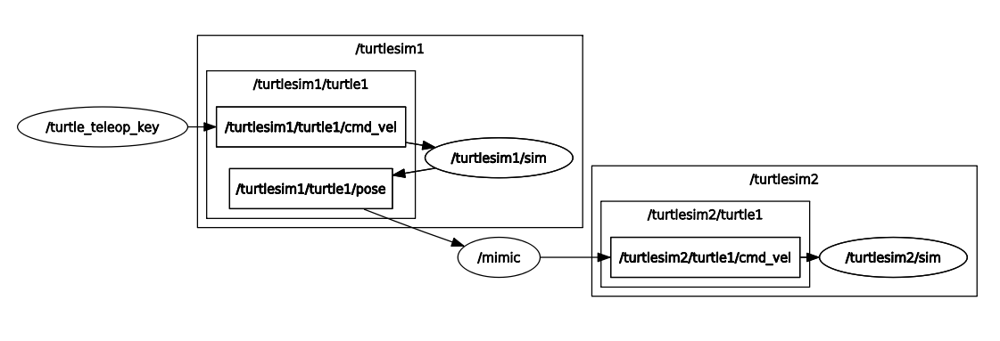

# ROS Basics

Tutorial básico usado na aula de ROS do Processo Seletivo da Comp.

Esse repositório contém um pacote com exemplos e exercícios básicos para treinar os conceitos aprendidos na aula.

## Requisitos

### Turtlesim
O turtlesim é um pacote usado no tutorial oficial do ROS. Normalmente ele já é instalado junto com ROS, mas talvez seja preciso instalar manualmente.
```bash
sudo apt install ros-noetic-ros-tutorials
```

## Exemplos

1. Talker

    Esse é literalmente o "Hello World" de ROS. O arquivo `talker.py` contém um publisher que publica uma mensagem do tipo std_msg/String para o tópico /chatter.

    Para exexutar, primeiro inicialize o roscore.
    ```bash
    roscore
    ```
    Em outro terminal, execute o node do talker (lembrando de dar source novamente).
    ```bash
    rosrun ros_basics talker.py
    ```
    Por fim, para visualizar as mensagens publicadas, é possível usar o comando `rostopic`.
    ```bash
    rostopic echo /chatter
    ```

2. Listener

    O arquivo `listener.py` contém um subscriber para o tópico /chatter que lê a mensagem publicada e printa no terminal. Depois de ja ter iniciado o roscore e o node do talker, rode o listener em um terceiro terminal.
    ```bash
    rosrun ros_basics listener.py
    ```

3. Chat

    Não é muito prático ficar abrindo vários terminais para rodar os diferentes nodes que seu programa precisa executar, para evitar isso, existem os launch files.

    Primeiro, dê `Ctrl+C` em todos os terminais abertos para matar todos os nodes e o roscore. Em seguida, escolha um deles e execute o launch file.
    ```bash
    roslaunch ros_basics chat.launch
    ```

4. Turtlesim

    Nesse exemplo, usaremos o pacote do turtlesim para rodar exemplos mais divertidos ~~e o que é mais divertido que tartarugas, não é mesmo?~~. Primeiro, incialize o roscore, como feito anteriormente, em seguida, execute o turtlesim_node.
    ```bash
    rosrun turtlesim turtlesim_node
    ```
    Em seguida, vamos executar o node de teleoperação.
    ```bash
    rosrun turtlesim turtle_teleop_key
    ```
    Agora podemos mover a tartaruga com as setas do teclado.

    Novamente, mate os dois nodes e o roscore e vamos fazer tudo isso usando somente um comando.
    ```bash
    roslaunch ros_basics teleop.launch
    ```
    Observe que apesar de todos os nodes executados estarem no pacote `turtlesim`, o launch file que os executou está nesse pacote.

    Enquanto a simulação roda, tente entender quais tópicos foram criados, quem publica neles e quem lê mensagem deles. Para isso, use o `rostopic list` ou o rqt. 

5. Turtle mimic

    Vamos fazer mais um último exemplo com tartarugas.
    ```bash
    roslaunch ros_basics mimic.launch
    ```
    Agora temos duas simulações rodando ao mesmo tempo. Veja que temos namespaces diferentes para cada uma, pois caso contrário, teríamos conflito entre os nomes das tartarugas. Além disso, temos o node mimic que pega a posição da tartaruga da primeira simulação e transforma em comandos de velocidade para a tartaruga da segunda simulação.

    

## Exercícios

1. Square

    Na pasta script, você irá encontrar o arquivo `square.py`. Utilize ele para implementar um node que controla a sua tartaruga para que ela desenhe continuamente um quadrado na tela. Instruções mais detalhadas se encontram no próprio arquivo.

2. Mimic

    Depois de entender o exemplo 5 (Turtle mimic), é hora de implementar o seu próprio node de mimic! Lembre-se que para testá-lo, é importante entender cada parte do launch file, pois ele também precisará ser modificado.

3. Square Mimic

    E se eu quisesse que o comportamento da minha primeira tartaruga fosse controlado pelo meu node de square, porém ainda quisesse uma segunda simulação que imitasse a primeira? Nesse ponto, você já tem todo o código necessário para isso, basta juntar tudo em um novo launch file.